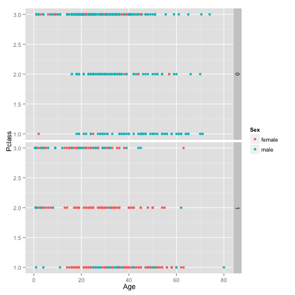

## Agenda

1. About this app - Survival Predictor
2. About Kaggle Titanic Challenge
3. Usage
4. Code for plots


--- .class #id 
## About this app - Survival Predictor
This app lets you predict who survives!

This App was developed as part of Coursera Developing Data Products Course Project.This is a very simple app making use of simple concepts of Exploratory Data Analysis on the Training set of the Kaggles Titanic Challenge Dataset. 

Github Link to App :  

Deployed at : http://vikasnp.shinyapps.io/survivalPredictor

## About Kaggle Titanic Challenge
The sinking of the RMS Titanic is one of the most infamous shipwrecks in history. On April 15, 1912, during her maiden voyage, the Titanic sank after colliding with an iceberg, killing 1502 out of 2224 passengers and crew. This sensational tragedy shocked the international community and led to better safety regulations for ships.
One of the reasons that the shipwreck led to such loss of life was that there were not enough lifeboats for the passengers and crew. Although there was some element of luck involved in surviving the sinking, some groups of people were more likely to survive than others, such as women, children, and the upper-class.

So analysing what sorts of people are likely to survive becomes important

--- .class #id 


## Usage
This App has a side panel in which you can change various parameters and set some parameters to each axis.

The Main Body of the App shows plots for the parameters selected in Side Panel.

The app also lets the user to experiment with the chosen data directly.

This app uses data set from Kaggles Titanic Challenge found here : https://www.kaggle.com/c/titanic/download/train.csv 

--- .class #id 
## Code for plots
ggplot 2 Library was used for the plotting. Code snippet for a graph sample:

```r
library(ggplot2)
trainData <- read.csv(url("http://s3-eu-west-1.amazonaws.com/dpadata/dataScience/train.csv"))
g <- ggplot(trainData, aes(Age, Pclass))
g + geom_point(aes(color=Sex)) + facet_grid(Survived ~.)
```

 
--- .class #id 

## References
For more information about RStudio Shinyapps.io visit:
http://shiny.rstudio.com/articles/shinyapps.html

For more information about Kaggle Titanic challenge visit:
https://www.kaggle.com/c/titanic-gettingStarted

This app development was inspired by the tutorial at http://trevorstephens.com/post/72916401642/titanic-getting-started-with
--- .class #id 
